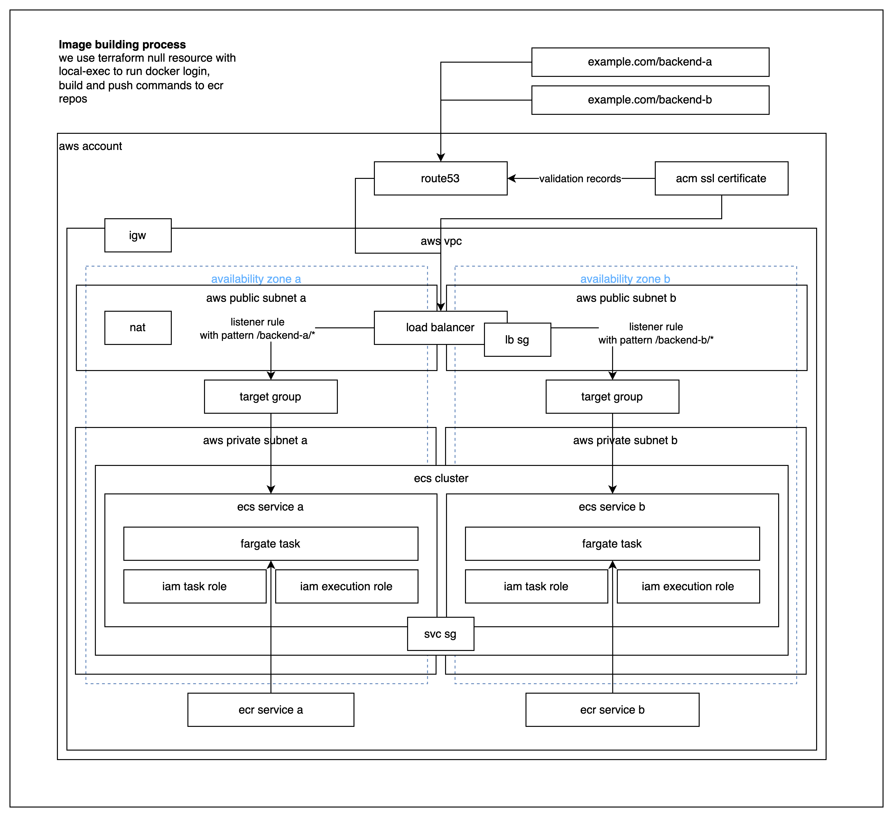

# Project README

## Project architecture diagram



## Overview

This project is an infrastructure setup using Terraform to deploy two backend services (`backend_a` and `backend_b`) on AWS. The architecture includes an Elastic Container Registry (ECR) for storing Docker images, an ECS cluster for running the services, and a VPC with public and private subnets for network isolation.

## Infrastructure Components

### 1. VPC (Virtual Private Cloud)

- **CIDR Block**: `10.0.0.0/16`
- **Subnets**:
  - **Public Subnets**:
    - `public_1`: CIDR `10.0.1.0/24`
    - `public_2`: CIDR `10.0.2.0/24`
  - **Private Subnets**:
    - `private_1`: CIDR `10.0.3.0/24`
    - `private_2`: CIDR `10.0.4.0/24`
- **Internet Gateway**: Allows internet access for resources in public subnets.

### 2. Elastic Container Registry (ECR)

- **Repositories**:
  - `backend_a`: Stores Docker images for the first backend service.
  - `backend_b`: Stores Docker images for the second backend service.

### 3. ECS (Elastic Container Service)

- **Cluster**: A dedicated cluster for running the backend services.
- **Services**:
  - **Service A** (`backend_a`):
    - Runs in Fargate mode.
    - Uses the Docker image from the `backend_a` ECR repository.
    - Exposes port 80.
  - **Service B** (`backend_b`):
    - Runs in Fargate mode.
    - Uses the Docker image from the `backend_b` ECR repository.
    - Exposes port 80.

### 4. Load Balancer

- **Type**: Application Load Balancer (ALB)
- **Listeners**:
  - HTTP (port 80) redirects to HTTPS (port 443).
  - HTTPS listener (port 443) serves a fixed response for unmatched paths.

### 5. Security Groups

- **Load Balancer Security Group**: Allows inbound traffic on ports 80 and 443.
- **ECS Service Security Group**: Allows inbound traffic on the container port.

### 6. ACM (AWS Certificate Manager)

- **Certificate**: Manages SSL/TLS certificates for secure communication over HTTPS.

### 7. Route 53

- **DNS Records**: Configured for domain validation of the ACM certificate.

## Backend Services

### Backend A

- **HTML File**: Displays a welcome message for Backend 1.
- **Dockerfile**: Uses Nginx to serve the HTML file.

### Backend B

- **HTML File**: Displays a welcome message for Backend 2.
- **Dockerfile**: Uses Nginx to serve the HTML file.

## Deployment

To deploy the infrastructure, run the following commands:

1. Initialize Terraform:
   ```bash
   terraform init
   ```

2. Plan the deployment:
   ```bash
   terraform plan
   ```

3. Apply the changes:
   ```bash
   terraform apply
   ```

## Conclusion

This project provides a scalable and secure infrastructure for deploying backend services on AWS using Terraform. The use of ECS and ECR allows for efficient container management and deployment.
